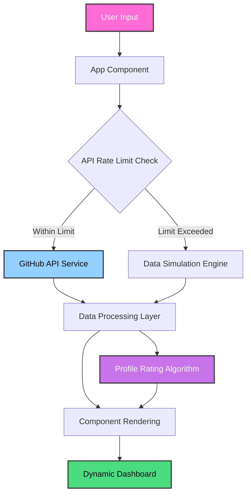

<div align="center">
  
  
  <br />
  <br />

  <h1>🌌 GitHubScope 🌌</h1>
  
  <p>
    <b>The ultimate retro-futuristic deep-dive into any GitHub profile.</b>
  </p>

  <p>
    
    
    
    
  </p>
</div>

---

## 🚀 Overview

**GitHubScope** is a high-performance, aesthetically stunning web application that allows users to perform deep-scans on any GitHub profile. It goes beyond simple statistics, providing a comprehensive analysis of coding languages, contribution history, and a proprietary **Profile Tier Rating** based on advanced metadata.

With a vibrant **Vaporwave / Synthwave** design, GitHubScope turns raw data into a premium visual experience.

---

## ✨ Key Features

- **🔍 Smart Search:** Instantly fetch and analyze GitHub users.
- **🏆 Profile Rating System:** A multi-dimensional algorithm that tiers profiles from 'D' to 'S+'.
- **📊 Language Visualization:** Interactive distribution charts of coding languages used.
- **📅 Activity Timeline:** Detailed contribution history and recent commit analysis.
- **📂 Repo Inspector:** Deep exploration of repositories, including README rendering and star/fork metrics.
- **🌙 High-End Aesthetic:** Premium dark-mode UI with motion-rich transitions and glassmorphism.
- **🤖 Intelligent Mocking:** Automatic fallback to simulated data when API rate limits are hit.

---

## 🏗️ Technical Architecture

GitHubScope is built with a modern, reactive stack designed for speed and visual excellence.

### System Workflow



### Core Technologies

- **React 18 + Vite:** Super-fast development and optimized build pipelines.
- **TypeScript:** Robust type-safety across the entire data fetching and processing layer.
- **Tailwind CSS:** Custom vaporwave utility tokens and retro-futuristic styling.
- **Motion (Framer Motion):** Silky smooth entrance animations and state transitions.
- **Lucide React:** Sleek, consistent iconography.

---

## 🧠 Core Concepts & Algorithms

### The Profile Rating Algorithm

The heart of GitHubScope is the `calculateProfileRating` function, which evaluates profiles based on six key metrics:

1.  **Biography Quality:** Analyzes the depth and descriptiveness of the user bio.
2.  **User Popularity:** Calculates a weighted score based on followers and average repository stars.
3.  **Repository Popularity:** Evaluates the impact of projects through stars and forks.
4.  **Metadata Completeness:** Rewards profiles with descriptions, locations, and website links.
5.  **Documentation (Webpages & Docs):** Checks for external links and documentation associated with repos.
6.  **Backlinks & Information:** Validates the completeness of profile identity (Company, Blog, Location).

#### Final Tier Tiers:
- **S+ (Cyber Deity):** Score 90+
- **S (Neon Legend):** Score 80-89
- **A (Synthwave Hacker):** Score 70-79
- **B (Retro Coder):** Score 50-69
- **C (Digital Explorer):** Score 30-49

---

## 🛠️ Performance & Scalability

GitHubScope is designed with performance in mind:
- **Skeleton Loading:** Ensures a perceivably fast experience even while fetching heavy API data.
- **Efficient Processing:** Heavy data processing (filtering, sorting, calculating scores) is done efficiently on the client-side.
- **Rate Limit Handling:** Robust error boundaries and fallback mechanisms prevent application crashes.

---

## 💻 Local Development

### Prerequisites
- Node.js (v18+)
- npm or yarn

### Setup
1. Clone the repository:
   ```bash
   git clone https://github.com/rehan9703/GitHubDeepScan.git
   ```
2. Install dependencies:
   ```bash
   npm install
   ```
3. Create a `.env` file and add your GitHub Token (Optional but recommended for higher rate limits):
   ```env
   VITE_GITHUB_TOKEN=your_token_here
   ```
4. Start the development server:
   ```bash
   npm run dev
   ```

---

## 📄 License

This project is licensed under the MIT License - see the [LICENSE](./LICENSE) file for details.

---

<div align="center">
  <i>Built with 💖 and 🦾 by Antigravity for GitHubDeepScan</i>
</div>
